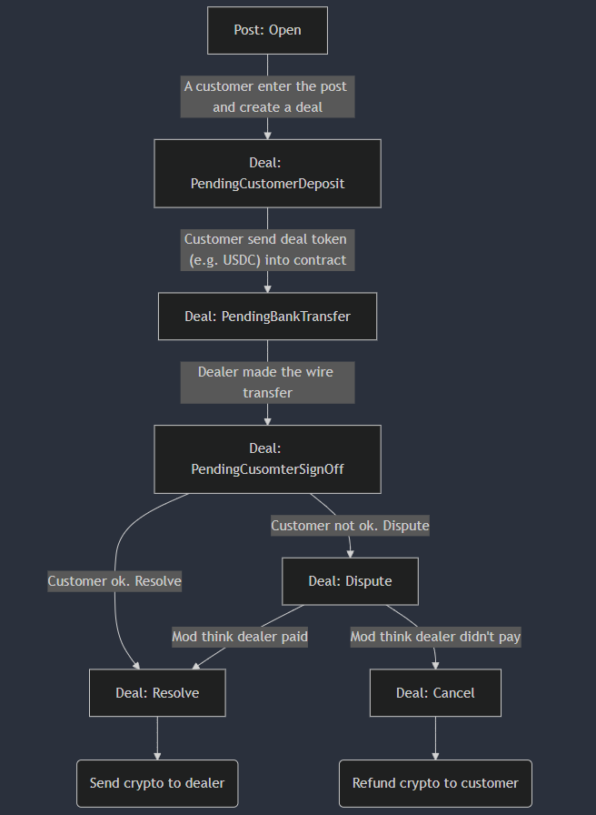
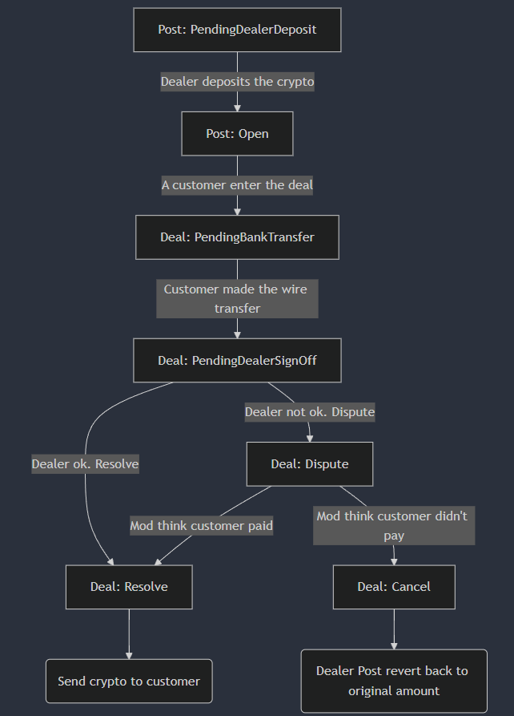

# FINA P2P

Fina P2P is a decentralized, privacy preserving, cross-chain P2P trading platform. It allows users to trade between fiat and crypto in a peer-to-peer manner with no KYC required. The entire trade process is governed by smart contracts with privacy features powered by Secret Network. This ensembles real-life p2p process where payment detail can only be seen by customer when a transaction (deal) reaches certain stage.

## Introduction

Fina P2P lists active `Post`(s) craeted by the `Dealer`. `Customer` can enter the `Post` and make a `Deal` with the dealer. Depending on the trade direction, `Customer` will perform a bank transfer / crypto deposit. Once the bank transfer is received and acknowledged by the counterpart, `Deal` will be resolved and crypto will be transferred from one to the other.

In the case of `Dispute`, independent `Moderator` will enter the deal, gathering the transaction info. submitted by both parties, and make the final verdict on whether to force `resolve` the deal, or `cancel` the deal and refund the crypto to the original depositor.

Whether the dealer is about to buy or sell crypto, the general flow remains the same
1. `A` deposits crypto into the contract
2. This notifies `B` to make bank wire transfer
3. After the transfer, `A` will confirm and resolve the deal. `B` can also resolve the deal if `A` doesn't respond after set amount of time
4. If `A` suspects `B` not making the wire transfer, `A` could dispute a deal.

`A` / `B` can be dealer or customer, depending on the context.

## Flow chart on the transaction

### Dealer buy crypto from customer

### Dealer sell crypto to customer

## Security and protection on customer

P2P flow is designed to protect customer at best effort.

In the case of dealer buying crypto, although customer needs to deposit crypto to the contract first, he/she can cancel the deal if dealer stay idle and does not make the bank transfer. In the case of dealer selling crypto, dealer must be the one who deposit crypto into the smart contract first, ensuring client is covered from fraudulent actor.